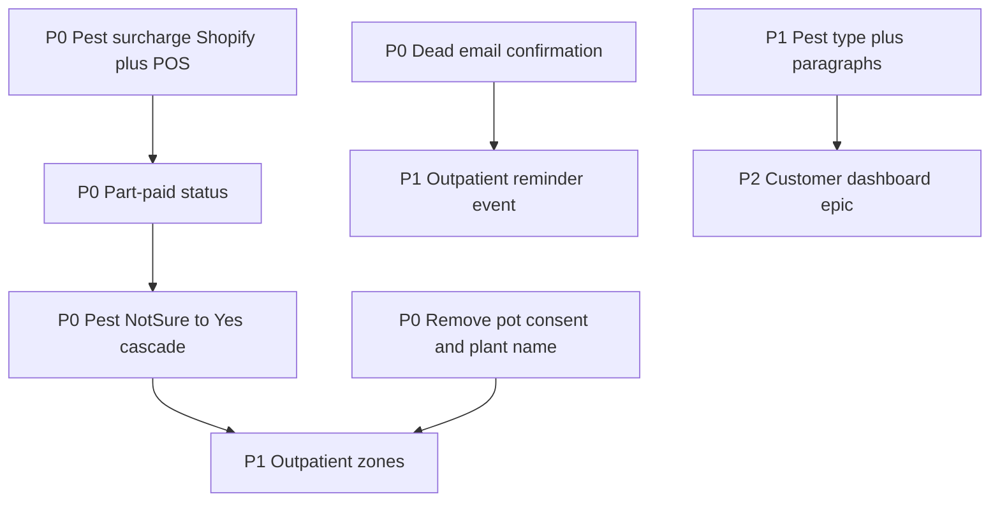

# Granola meeting checklist

Source: plant-page bugs, pests, payments, guarantee, outpatient zones, customer dashboard, Zoho/kits notes.

Amendments locked in earlier: outpatient reminder = Mailchimp event only (no status-strip log); part-paid includes pest-only Shopify surcharge SKUs + POS.

**P0 eng + ship:** done ([HIL-128](https://linear.app/hilda-houseplant-hospital/issue/HIL-128) / [HIL-129](https://linear.app/hilda-houseplant-hospital/issue/HIL-129); migration `0037`; live Worker; [PR #4](https://github.com/RosannaCostello/Houseplant-Hospital/pull/4)).

**P1 eng + ship:** done for product items #7–14 ([HIL-131](https://linear.app/hilda-houseplant-hospital/issue/HIL-131)–[HIL-137](https://linear.app/hilda-houseplant-hospital/issue/HIL-137); migrations `0038` + `0039` applied; live Workers through `122106a1`). Next Granola app epic: **P2**.

---

## Already done (don’t re-open unless refining)

- [x] **Pest plants propagatable** — [HIL-127](https://linear.app/hilda-houseplant-hospital/issue/HIL-127) (always allow; child inherits pests Yes if source Yes/Not sure). Meeting also mentioned a “tick box override”; current ship is unconditional allow, not a checkbox.
- [x] **Pests Yes/No/Not sure UI** — [HIL-124](https://linear.app/hilda-houseplant-hospital/issue/HIL-124)
- [x] **Pest treatment options catalog** — [HIL-107](https://linear.app/hilda-houseplant-hospital/issue/HIL-107) / [HIL-104](https://linear.app/hilda-houseplant-hospital/issue/HIL-104); extended by P1 #10 ([HIL-131](https://linear.app/hilda-houseplant-hospital/issue/HIL-131)) with **Add another treatment** beyond 1–3.

---

## P0 — App fixes (staff pain / broken flows)

- [x] **1. Pest “Not sure” → Yes post–check-in cascade** (named for Rosanna in notes) — [HIL-128](https://linear.app/hilda-houseplant-hospital/issue/HIL-128)
  - On change to Yes: auto Quarantine (from Check-in only; already-quarantine Not sure plants stay), pests badge, treatments UI, reprice, mark **part paid** when visit was paid, email customer via Mailchimp **`bugs_found`** (pests + extra charge).
  - Related backlog: **[HIL-77](https://linear.app/hilda-houseplant-hospital/issue/HIL-77)** (paid status + pests after payment) — badge/alert shipped with cascade.
- [x] **2. Part-paid payment status** — [HIL-128](https://linear.app/hilda-houseplant-hospital/issue/HIL-128)
  - First-class visit payment state for check-in mistakes / mid-stay pest surcharge (replace emoji-in-notes workaround).
  - Dashboard / plant detail badge + **Pests found after payment** alert; collect blocked while part paid (same as other unpaid states) unless paid another way.
  - Amount still owed is the Shopify pests-surcharge line (delta), not a separate in-app ledger.
- [x] **3. Pest-only Shopify surcharge + POS** — [HIL-128](https://linear.app/hilda-houseplant-hospital/issue/HIL-128)
  - Previously only **full** Standard / Pests / Propagation variants — no “pay the pest difference only” SKU.
  - Shopify **pest surcharge** product created (per size, priced at `pests − standard`): product `16031780831613`.
  - Wired into `lib/shopify/config.ts` (`pestsSurchargeVariantId`).
  - When visit becomes `part_paid` after late pests Yes: queue a Pending check-ins cart with those surcharge line items (same POS extension path).
  - On till payment → visit back to `paid`.
  - If visit still unpaid / pay-at-collection / queued: rebuild **full** pests cart instead of surcharge.
- [x] **4. Dead move gate** — [HIL-129](https://linear.app/hilda-houseplant-hospital/issue/HIL-129)
  - Confirm “customer has been emailed” before allowing Dead (confirm copy on move).
- [x] **5. Remove pot size change consent** — [HIL-129](https://linear.app/hilda-houseplant-hospital/issue/HIL-129)
  - Removed from check-in + plant detail display. Column left in DB (always written `false` on new check-ins); schema drop optional later.
- [x] **6. Remove plant name field** — [HIL-129](https://linear.app/hilda-houseplant-hospital/issue/HIL-129)
  - Species only in check-in Photos + Update plant.
  - Labels / Mailchimp `plant_name` / print payload use **species** (legacy `name` column unused for new plants).

### P0 ship leftover (ops)

- [x] Apply Supabase migration `0037_part_paid_payment_status.sql` (adds `part_paid` to `pos_payment_status`)
- [x] Commit / push / deploy P0 code live — branch `jack/hil-128-p0-pests-cascade`, [PR #4](https://github.com/RosannaCostello/Houseplant-Hospital/pull/4)
- [x] Handbook updated in repo and live with deploy
- [ ] Merge open PRs into `main` (optional cleanup; live already on branch deploys) — [#4](https://github.com/RosannaCostello/Houseplant-Hospital/pull/4)–[#9](https://github.com/RosannaCostello/Houseplant-Hospital/pull/9)

---

## P1 — Product features (near-term)

- [x] **7. Outpatient zones** — [HIL-131](https://linear.app/hilda-houseplant-hospital/issue/HIL-131) / [HIL-132](https://linear.app/hilda-houseplant-hospital/issue/HIL-132) / [HIL-133](https://linear.app/hilda-houseplant-hospital/issue/HIL-133)
  - Settings catalog (seed Office / Quarantine; staff renamed to e.g. **Houseplant Hospital**).
  - Required zone when confirming move to Outpatient; chip on Dashboard card.
  - Editable on **Update plant** while Outpatient ([HIL-132](https://linear.app/hilda-houseplant-hospital/issue/HIL-132)).
  - Backfill: all then-current Outpatients → Houseplant Hospital ([HIL-133](https://linear.app/hilda-houseplant-hospital/issue/HIL-133); migration `0039` applied).
- [x] **8. Outpatient 2-week reminder** (**amended**) — [HIL-131](https://linear.app/hilda-houseplant-hospital/issue/HIL-131)
  - Cron enqueues `plant_outpatient_reminder` every **14 days** while Outpatient (dedupe via `mailchimp_events`).
  - **Ops leftover:** Jack builds/activates the Mailchimp journey on that trigger (emails not customer-facing until then).
- [x] **9. Pest type at check-in/surgery** — [HIL-131](https://linear.app/hilda-houseplant-hospital/issue/HIL-131) / [HIL-134](https://linear.app/hilda-houseplant-hospital/issue/HIL-134) / [HIL-135](https://linear.app/hilda-houseplant-hospital/issue/HIL-135)
  - Settings: pest type → treatment-notes paragraph; select at check-in / Update plant; autofills notes when blank.
  - Required before Outpatient when pests are Yes ([HIL-135](https://linear.app/hilda-houseplant-hospital/issue/HIL-135)).
  - Dashboard: single gold badge = bug icon, or icon + type name ([HIL-134](https://linear.app/hilda-houseplant-hospital/issue/HIL-134)).
- [x] **10. Multiple treatments per round** — [HIL-131](https://linear.app/hilda-houseplant-hospital/issue/HIL-131)
  - **Add another treatment** beyond 1–3; Outpatient still needs ≥3 when pests require treatments.
- [x] **11. Dashboard search by pest type** — [HIL-131](https://linear.app/hilda-houseplant-hospital/issue/HIL-131) / [HIL-137](https://linear.app/hilda-houseplant-hospital/issue/HIL-137)
  - Search box matches pest type labels (name / email / pest).
  - **All pests** dropdown removed ([HIL-137](https://linear.app/hilda-houseplant-hospital/issue/HIL-137)) — search only.

### P1 polish (shipped with P1)

- [x] Temporary red outlines on missing Outpatient readiness fields when move blocked ([HIL-136](https://linear.app/hilda-houseplant-hospital/issue/HIL-136)) — same idea as check-in notes validation.

### P1 ship leftover (ops)

- [x] Apply Supabase migration `0038_outpatient_zones_pest_types_treatments.sql`
- [x] Apply Supabase migration `0039_backfill_outpatient_zone_houseplant_hospital.sql`
- [ ] Mailchimp journey for event **`plant_outpatient_reminder`** (ties to #8)

---

## P1 — Payments / Shopify (mixed ops + light app)

- [x] **12. Shopify “guarantee” 100% discount code** (ops in Shopify) — code **`GUARANTEE26`**.
- [x] **13. Guarantee flow in app** — **effectively done**: staff use **`GUARANTEE26`** in Shopify POS (handbook); no separate in-app guarantee flow planned.
- [x] **14. Shopify logins per staff** — **out of scope** (ops / Shopify Admin only; not HHH app work).

---

## P2 — Customer Care Card (epic)

- [x] **15a. Customer Care Card (public visit page)** — [HIL-138](https://linear.app/hilda-houseplant-hospital/issue/HIL-138)
  - `/hh/care/[visitId]` — whole drop-off; Quarantine / In Surgery nomenclature; timeline; aftercare gated post-surgery; pests when Yes.
  - Legacy `/hh/case/[plantId]` redirects here. Staff: **Open Care Card**.
  - Hosting / new domain: deferred (current Workers URL).
- [x] **15b. Thin emails + `care_card_url` on all plant events** — [HIL-139](https://linear.app/hilda-houseplant-hospital/issue/HIL-139)
  - App sends `care_card_url`; stops sending treatment notes / care tips on events.
  - **Ops:** update Mailchimp journey templates to CTA the Care Card (collection nurture).
- [x] **15c. Mailchimp Transactional (Route A)** — [HIL-140](https://linear.app/hilda-houseplant-hospital/issue/HIL-140) / templates [HIL-141](https://linear.app/hilda-houseplant-hospital/issue/HIL-141)
  - Hospital events → Mandrill Transactional templates (`hh-…`); `plant_collected` stays on Marketing Journeys for nurture.
  - **Ops:** edit copy in Transactional → Outbound → Templates; deactivate old hospital Marketing journeys; keep collection nurture consent-gated.

---

## Ops / non-eng (owners from notes)

- [ ] **16.** Confirm ownership of **houseplanthospital.co** (Tom?).
- [ ] **17.** **Upgrade Acuity** plan (~£20–34/mo) to activate booking→draft link (already built).
- [x] **18.** Create Shopify **guarantee** discount code (ties to #12) — **`GUARANTEE26`**.
- [ ] **19.** Manually migrate **4–5 Zoho propagation plants**; then cancel Zoho (~£28/mo).
- [ ] **20.** Rosanna: investigate **auto-import** remaining Zoho without bulk Mailchimp emails.
- [ ] **21.** Kits MVP / membership: strategy only for now (not HHH app unless scoped later). SOS bookings stay on Zoho/Zoom.
- [x] **22.** **Ops: create Pest surcharge Shopify product/variants** (required for P0 #3; prices = pests − standard per size) — done: product `16031780831613`, Mini–XL variants wired in app config.
- [ ] **23.** **Ops: Mailchimp journey** on `plant_outpatient_reminder` (required for P1 #8 customer emails).

---

## Part-paid + pest-only Shopify execution

### What exists now (after P0)

- Per size: full **Standard**, **Pests**, **Propagation**, plus **pests surcharge** (delta) variants — `lib/shopify/config.ts`.
- Check-in cart still uses full Pests or Standard — `lib/shopify/build-pos-cart-from-plants.ts`.
- Late pests Yes stores delta on `pricing_adjustments` **and** queues surcharge POS cart when visit was paid — `lib/plants/set-bugs-found.ts`.
- POS extension loads variant IDs; surcharge SKUs are real Shopify products.

### Build sequence (P0 #2 + #3) — completed in code

1. [x] Shopify: create **Pest surcharge** product with Mini–XL variants priced at delta; IDs in `SHOPIFY_VARIANT_IDS`.
2. [x] App: add `part_paid` to visit `payment_status`; badge + alert on dashboard/detail.
3. [x] On pests → Yes after `paid`: set `part_paid`, queue `pos_line_items` with surcharge variant(s) onto Pending check-ins.
4. [x] POS payment webhook/flow: when that balance cart is paid → `paid`.
5. [x] Cascade (#1) uses the same path (quarantine + part_paid + surcharge cart + Mailchimp).
6. [x] Live: apply `0037` + deploy (PR #4).

---

## Suggested eng order (historical)

**Status:** P0 + P1 eng done (or OOS). P2 Care Card + thin emails + Transactional Route A shipped ([HIL-138](https://linear.app/hilda-houseplant-hospital/issue/HIL-138) / [HIL-139](https://linear.app/hilda-houseplant-hospital/issue/HIL-139) / [HIL-140](https://linear.app/hilda-houseplant-hospital/issue/HIL-140)). Ops: deactivate old hospital Marketing journeys; keep `plant_collected` nurture consent-gated; optional PR merges to `main`. Handbook updates required for any staff-facing ship.
