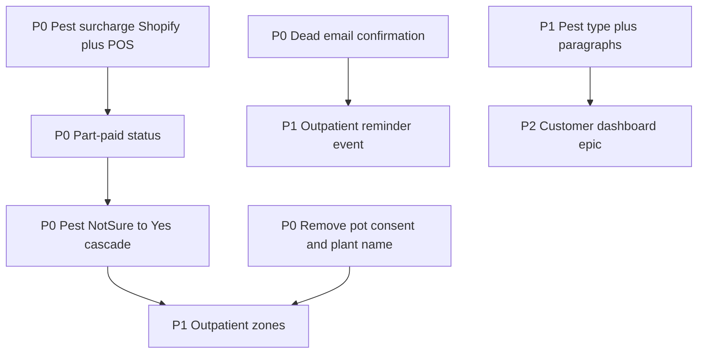

# Granola meeting checklist

Source: plant-page bugs, pests, payments, guarantee, outpatient zones, customer dashboard, Zoho/kits notes.

Amendments locked in earlier: outpatient reminder = Mailchimp event only (no status-strip log); part-paid includes pest-only Shopify surcharge SKUs + POS.

**P0 eng + ship:** done ([HIL-128](https://linear.app/hilda-houseplant-hospital/issue/HIL-128) / [HIL-129](https://linear.app/hilda-houseplant-hospital/issue/HIL-129); migration `0037`; live Worker `275db517`; [PR #4](https://github.com/RosannaCostello/Houseplant-Hospital/pull/4)). Next app work: **P1**.

---

## Already done (don’t re-open unless refining)

- [x] **Pest plants propagatable** — [HIL-127](https://linear.app/hilda-houseplant-hospital/issue/HIL-127) (always allow; child inherits pests Yes if source Yes/Not sure). Meeting also mentioned a “tick box override”; current ship is unconditional allow, not a checkbox.
- [x] **Pests Yes/No/Not sure UI** — [HIL-124](https://linear.app/hilda-houseplant-hospital/issue/HIL-124)
- [x] **Pest treatment options catalog** — **Partial** — [HIL-107](https://linear.app/hilda-houseplant-hospital/issue/HIL-107) / [HIL-104](https://linear.app/hilda-houseplant-hospital/issue/HIL-104) (3 locked slots when pests Yes; not “multiple per round” + pest-type paragraphs — see P1 #9–10)

---

## P0 — App fixes (staff pain / broken flows)

- [x] **1. Pest “Not sure” → Yes post–check-in cascade** (named for Rosanna in notes) — [HIL-128](https://linear.app/hilda-houseplant-hospital/issue/HIL-128)
  - On change to Yes: auto Quarantine (from Check-in only; already-quarantine Not sure plants stay), pests badge, treatments UI, reprice, mark **part paid** when visit was paid, email customer via Mailchimp **`bugs_found`** (pests + extra charge).
  - Related backlog: **[HIL-77](https://linear.app/hilda-houseplant-hospital/issue/HIL-77)** (paid status + pests after payment) — badge/alert shipped with cascade.
- [x] **2. Part-paid payment status** — [HIL-128](https://linear.app/hilda-houseplant-hospital/issue/HIL-128)
  - First-class visit payment state for check-in mistakes / mid-stay pest surcharge (replace emoji-in-notes workaround).
  - Dashboard / plant detail badge + **Pests found after payment** alert; collect blocked while part paid (same as other unpaid states) unless paid another way.
  - Amount still owed is the Shopify pests-surcharge line (delta), not a separate in-app ledger.
- [x] **3. Pest-only Shopify surcharge + POS** — [HIL-128](https://linear.app/hilda-houseplant-hospital/issue/HIL-128)
  - Previously only **full** Standard / Pests / Propagation variants — no “pay the pest difference only” SKU.
  - Shopify **pest surcharge** product created (per size, priced at `pests − standard`): product `16031780831613`.
  - Wired into `lib/shopify/config.ts` (`pestsSurchargeVariantId`).
  - When visit becomes `part_paid` after late pests Yes: queue a Pending check-ins cart with those surcharge line items (same POS extension path).
  - On till payment → visit back to `paid`.
  - If visit still unpaid / pay-at-collection / queued: rebuild **full** pests cart instead of surcharge.
- [x] **4. Dead move gate** — [HIL-129](https://linear.app/hilda-houseplant-hospital/issue/HIL-129)
  - Confirm “customer has been emailed” before allowing Dead (confirm copy on move).
- [x] **5. Remove pot size change consent** — [HIL-129](https://linear.app/hilda-houseplant-hospital/issue/HIL-129)
  - Removed from check-in + plant detail display. Column left in DB (always written `false` on new check-ins); schema drop optional later.
- [x] **6. Remove plant name field** — [HIL-129](https://linear.app/hilda-houseplant-hospital/issue/HIL-129)
  - Species only in check-in Photos + Update plant.
  - Labels / Mailchimp `plant_name` / print payload use **species** (legacy `name` column unused for new plants).

### P0 ship leftover (ops)

- [x] Apply Supabase migration `0037_part_paid_payment_status.sql` (adds `part_paid` to `pos_payment_status`)
- [x] Commit / push / deploy P0 code live — branch `jack/hil-128-p0-pests-cascade`, [PR #4](https://github.com/RosannaCostello/Houseplant-Hospital/pull/4), Worker `275db517-96d0-47d8-a2dc-050331af8cf1` (2026-09-23)
- [x] Handbook updated in repo and live with deploy
- [ ] Merge [PR #4](https://github.com/RosannaCostello/Houseplant-Hospital/pull/4) into `main` (optional cleanup; live already on branch deploy)

---

## P1 — Product features (near-term)

- [ ] **7. Outpatient zones**
  - Required zone when moving to Outpatient (Settings-managed list; seed office + quarantine).
  - Show on plant card; not required for inpatients.
- [ ] **8. Outpatient 2-week reminder** (**amended**)
  - **Not** status-strip “First reminder sent [date]”.
  - App cron enqueues a new Mailchimp event every **14 days** while plant remains outpatient (until collected/dead).
  - Event name: `plant_outpatient_reminder` (matches existing `plant_*` naming).
  - Dedupe via `mailchimp_events` (no new plant columns). Jack builds/activates the Mailchimp journey on that trigger.
- [ ] **9. Pest type at check-in/surgery**
  - Settings: pest type → pre-written paragraph(s).
  - Selecting type auto-fills customer-facing notes; stop copy-paste from free notes.
- [ ] **10. Multiple treatments per round** (beyond current 1–3 locked slots model if still insufficient).
- [ ] **11. Dashboard search/filter by pest type** (e.g. fungus gnats).

---

## P1 — Payments / Shopify (mixed ops + light app)

- [ ] **12. Shopify “guarantee” 100% discount code** (ops in Shopify; optional Analytics count later).
- [ ] **13. Guarantee flow in app**
  - Prefer Shopify as source of truth; reduce reliance on “paid another way”; Analytics can surface guarantee count from Shopify if useful.
- [ ] **14. Shopify logins per staff** (ops / Shopify Admin — accountability for discounts; out of app scope unless POS identity is later wired).

---

## P2 — Customer dashboard (epic)

- [ ] **15. Customer-facing plant dashboard** (split admin vs customer product)
  - Hosting (domain: check `houseplanthospital.co` / Tom).
  - Login vs magic-link still undecided — decide before build.
  - Care notes / aftercare hero; journey timeline secondary (parcel-tracking simple).
  - Emails shrink to one-liners + link; notes/tips live on dashboard.

---

## Ops / non-eng (owners from notes)

- [ ] **16.** Confirm ownership of **houseplanthospital.co** (Tom?).
- [ ] **17.** **Upgrade Acuity** plan (~£20–34/mo) to activate booking→draft link (already built).
- [ ] **18.** Create Shopify **guarantee** discount code (ties to #12).
- [ ] **19.** Manually migrate **4–5 Zoho propagation plants**; then cancel Zoho (~£28/mo).
- [ ] **20.** Rosanna: investigate **auto-import** remaining Zoho without bulk Mailchimp emails.
- [ ] **21.** Kits MVP / membership: strategy only for now (not HHH app unless scoped later). SOS bookings stay on Zoho/Zoom.
- [x] **22.** **Ops: create Pest surcharge Shopify product/variants** (required for P0 #3; prices = pests − standard per size) — done: product `16031780831613`, Mini–XL variants wired in app config.

---

## Part-paid + pest-only Shopify execution

### What exists now (after P0)

- Per size: full **Standard**, **Pests**, **Propagation**, plus **pests surcharge** (delta) variants — `lib/shopify/config.ts`.
- Check-in cart still uses full Pests or Standard — `lib/shopify/build-pos-cart-from-plants.ts`.
- Late pests Yes stores delta on `pricing_adjustments` **and** queues surcharge POS cart when visit was paid — `lib/plants/set-bugs-found.ts`.
- POS extension loads variant IDs; surcharge SKUs are real Shopify products.

### Build sequence (P0 #2 + #3) — completed in code

1. [x] Shopify: create **Pest surcharge** product with Mini–XL variants priced at delta; IDs in `SHOPIFY_VARIANT_IDS`.
2. [x] App: add `part_paid` to visit `payment_status`; badge + alert on dashboard/detail.
3. [x] On pests → Yes after `paid`: set `part_paid`, queue `pos_line_items` with surcharge variant(s) onto Pending check-ins.
4. [x] POS payment webhook/flow: when that balance cart is paid → `paid`.
5. [x] Cascade (#1) uses the same path (quarantine + part_paid + surcharge cart + Mailchimp).
6. [x] Live: apply `0037` + deploy (Worker `275db517`; PR #4).

---

## Suggested eng order (historical)

P0 eng block is done; next app work starts at **P1 #7 zones** (or #8 reminder if preferred). One `HIL-*` per P0/P1 app item. Handbook updates required for any staff-facing ship.
